# Pet Heaven: Animal Shelter Data Collection & Local Data Persistence Demo

This project is a web application developed to support the efficient operation of an animal shelter. It primarily focuses on **building a foundational data pipeline to systematically collect essential operational data through various forms (Adoption, Volunteer, Donation, Pet Release) and store it in a MongoDB database.**

The aim of this project is to demonstrate the **importance of structured data collection and the implementation of data persistence using MongoDB** to overcome the limitations of traditional manual or fragmented data management methods.

---

## Core Data Collection Features

This application includes several key forms designed for specific data collection purposes:

* **Adoption Form:** Collects data on adoption applicants, including personal information and preferred pet types, providing **insights into adoption demand and applicant characteristics.**
* **Volunteer Form:** Gathers volunteer details, preferred roles, and availability, crucial for **human resource management and volunteer activity tracking.**
* **Donation Form:** Records donation amounts, types, and payment information (note: sensitive payment data is handled with security considerations in mind, but for this demo, it's stored directly for persistence demonstration), enabling **financial analysis and understanding donation patterns.**
* **Pet Release Form:** Captures detailed information about animals being relinquished (name, age, breed, health info, reason for release), contributing to **animal welfare and shelter intake data.**

---

## Database & Data Persistence

All collected data is securely stored in **MongoDB, a flexible NoSQL database**. Mongoose ODM (Object Data Modeling) is utilized to efficiently manage and validate data according to defined schemas for each form.

Notably, sensitive information such as user passwords (if signup is implemented) is **one-way hashed using `bcryptjs`** before being stored, enhancing data security.

---

## 🔐 User Authentication

- **Signup**: Hashes passwords before storing in `users` collection
- **Login**: Issues JWT token for session management
- **Dynamic Navigation**: Updates navbar based on login state
- **Profile Page**: Displays user details
- **Logout**: Clears session and reverts UI

---

## Significance from a Big Data Perspective

This project goes beyond simple web development; it showcases a **practical approach to structuring and collecting diverse types of semi-structured/unstructured data** generated from real-world service operations.

The collected data serves as a foundation for future Big Data analysis and applications, such as:

* **Predictive Modeling:** Forecasting adoption success rates for specific animal types, or volunteer retention.
* **Operational Optimization:** Optimizing volunteer scheduling based on peak activity times, or analyzing the effectiveness of fundraising campaigns.
* **Insight Generation:** Deriving insights into common health issues, behavioral traits, or reasons for relinquishment to improve animal welfare policies.
* **Data Pipeline Foundation:** The form-based data collection implemented here represents the crucial first step of **data ingestion** within a broader data analytics pipeline.

---

## Technologies Used

* **Frontend:** `React.js`, `React Router DOM` 
* **Backend:** `Node.js`, `Express.js`, `Mongoose`, `bcryptjs`, `cors`, `jsonwebtoken`
* **Database:** `MongoDB`
* **Tools:** `npm` / `yarn`, `VS Code`, **`MongoDB Compass`**

---

## Demonstrating Data Persistence with MongoDB Compass

This project demonstrates the **successful storage of submitted form data into a MongoDB database within a local development environment.**

Below, you can find screenshots from MongoDB Compass, visually confirming how the data collected from each form is structured and saved in its respective collection.

### MongoDB Compass Overview
MongoDB Compass: Database and Collections Overview
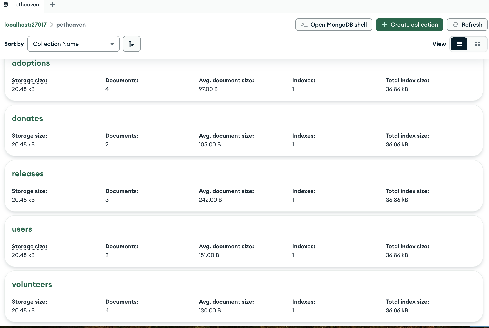

---

### Adoption Form Data

Here's an example of the Adoption Form filled out on the web application:
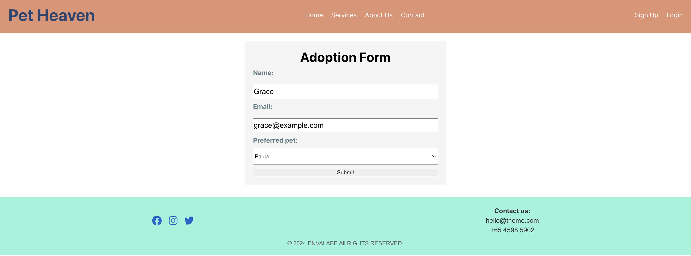

And here's how the submitted data is stored in the `adoptions` collection within MongoDB Compass:
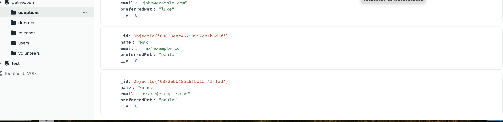

---

### Volunteer Form Data

Here's an example of the Volunteer Form filled out on the web application:
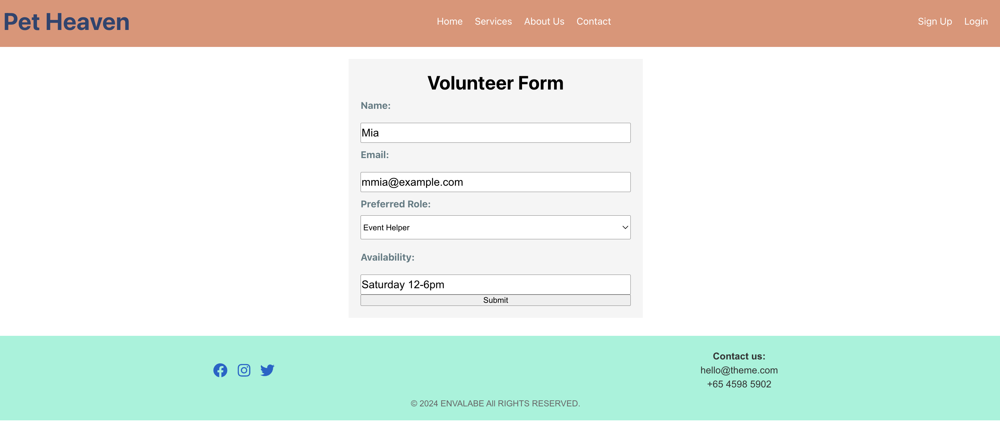

And here's how the submitted data is stored in the `volunteers` collection within MongoDB Compass:
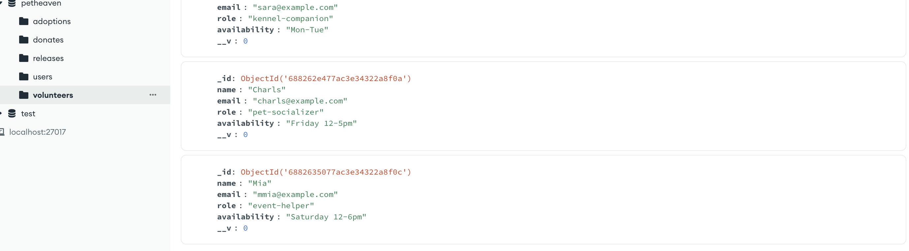

---

### Donation Form Data

Here's an example of the Donation Form filled out on the web application:
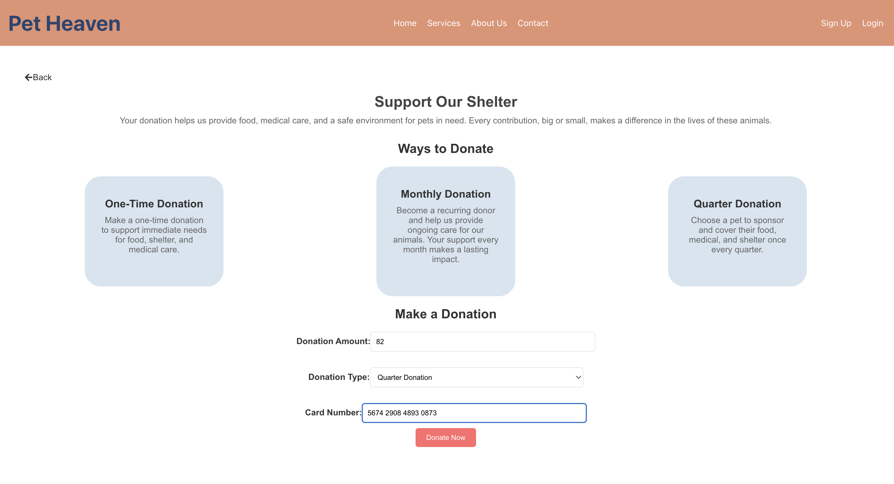

And here's how the submitted data is stored in the `donates` collection within MongoDB Compass:
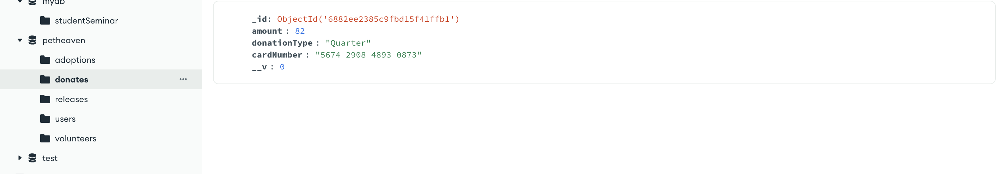

---

### Pet Release Form Data

Here's an example of the Pet Release Form filled out on the web application:
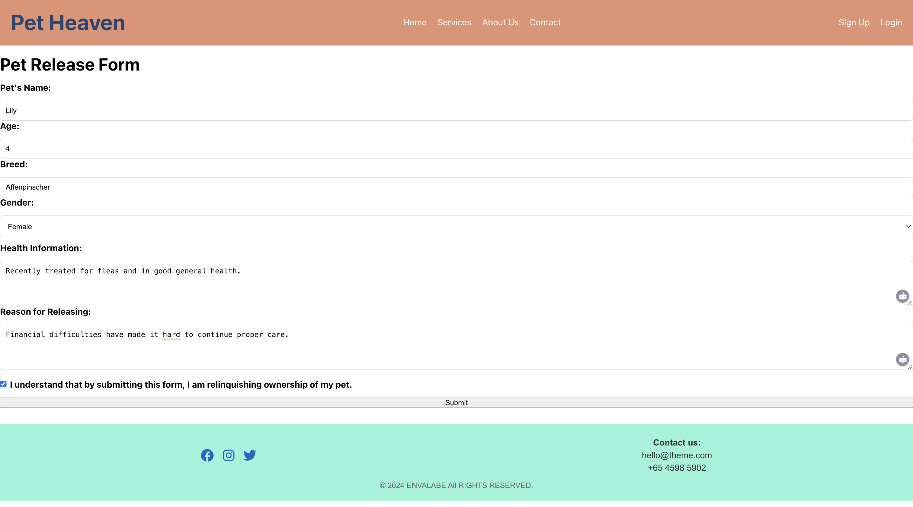

And here's how the submitted data is stored in the `releases` collection within MongoDB Compass:
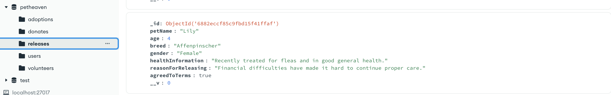

---

### User Data (Optional - if signup implemented)

Here's an example of the Signup Form filled out on the web application:
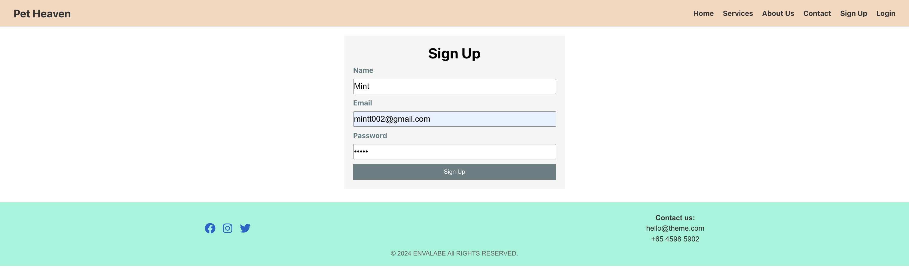

And here's how the user data, including the hashed password, is stored in the `users` collection within MongoDB Compass:
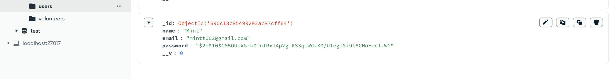

=======
Here's if our login is completed successfully:


---

## Setup & Run Locally

To run this project on your local machine, follow these steps:

### Prerequisites

* **Node.js:** (e.g., v18 or higher)
* **npm** or **yarn**
* **MongoDB:** Installed and running locally (ensure your MongoDB server is active).
* **MongoDB Compass:** (Optional, but recommended for data verification)

### Installation

1.  **Clone the repository:**
    ```bash
    git clone [YOUR_GITHUB_REPOSITORY_URL]
    cd your-project-name # e.g., cd pet-heaven-mern-stack
    ```

2.  **Install backend dependencies:**
    ```bash
    cd server
    npm install # or yarn install
    ```

3.  **Install frontend dependencies:**
    ```bash
    cd ../client
    npm install # or yarn install
    ```

### Environment Variables Setup

Create `.env` files in both the `server` and `client` directories. These files are crucial for configuring database connections and API URLs, and they are ignored by Git for security reasons.

1.  **Create `server/.env`:**
    ```
    PORT=5001
    MONGO_URI=mongodb://localhost:27017/petheaven
    FRONTEND_URL=http://localhost:3000
    # JWT_SECRET=your_super_secret_key_for_jwt (if implementing login)
    ```

2.  **Create `client/.env`:**
    ```
    REACT_APP_API_URL=http://localhost:5001
    ```

### Run the Applications

1.  **Start the backend server:**
    Open your first terminal window, navigate to the `server` directory, and run:
    ```bash
    cd server
    node app.js # or nodemon app.js (if installed for auto-restarts)
    ```
    You should see messages indicating the server is running and connected to MongoDB.

2.  **Start the frontend client:**
    Open your second terminal window, navigate to the `client` directory, and run:
    ```bash
    cd client
    npm start # or yarn start
    ```
    This will open the React application in your default web browser.

### Access & Verify Data

1.  **Access the application:**
    Open your web browser and navigate to `http://localhost:3000` (or the port indicated by your React app).
2.  **Interact with the forms:**
    Go to the Adoption, Volunteer, Donation, and Pet Release forms. Fill them out and submit the data.
3.  **Verify Data Storage:**
    After submitting a form, open **MongoDB Compass** and connect to your local MongoDB instance. Navigate to the `petheaven` database and explore the `adoptions`, `volunteers`, `donates`, and `releases` collections. You will be able to verify that the submitted data is successfully stored in the respective collections.

---

## Future Enhancements

This project serves as a robust foundation, and future enhancements could include:

* **Cloud Deployment:** Deploying the backend server and MongoDB database to cloud services (e.g., Render, MongoDB Atlas) to enable a fully operational web application accessible globally.
* **Data Visualization & Analytics Dashboard:** Implementing a dashboard to visualize collected data, such as adoption rates, volunteer hours, and donation trends, using libraries like `D3.js` or `Chart.js`.
* **Advanced Data Analysis:** Applying advanced Big Data analytics techniques to the collected data for insights, such as predicting adoption success rates for specific animals, optimizing volunteer placement, or analyzing donation patterns.
* **User Authentication & Authorization:** Implementing full user login/signup, session management, and role-based access control.
=======

