# 🐾 Pet Heaven: Animal Shelter Data Collection & Full-Stack Web Application

Pet Heaven is a **full-stack web application** developed to support the efficient operation of an animal shelter.

The application focuses on **systematically collecting and storing operational data** through various forms, including Adoption, Volunteer, Donation, and Pet Release, while also implementing a **secure user authentication system with real email verification**.

The project demonstrates the integration of **structured data collection, MongoDB data persistence, secure authentication, email verification, frontend/backend communication, and cloud deployment** within a practical animal shelter management scenario.

🌐 **Live Application:**  
https://pet-heaven-s0d7.onrender.com

> **Note:** The application uses Render's free hosting tier. The backend may spin down after a period of inactivity, so the first request may take around 50 seconds or longer while the service starts.

---

## ✨ Key Features

- **Adoption Data Collection** – Collects adoption applicant information and pet preferences
- **Volunteer Management** – Records volunteer details, roles, and availability
- **Donation Data Collection** – Stores donation-related information
- **Pet Release Management** – Records information about animals being relinquished
- **MongoDB Atlas Data Persistence** – Stores application data in a cloud-hosted MongoDB database
- **Email Verification** – Sends a 6-digit verification code during registration
- **Time-Limited Verification** – Verification codes expire after 10 minutes
- **Resend Code** – Allows users to request another verification code
- **Secure Password Validation** – Enforces multiple password requirements
- **Password Hashing** – Protects passwords using `bcryptjs`
- **JWT Authentication** – Manages authenticated user sessions
- **Dynamic Navigation** – Updates the interface according to login state
- **User Profile** – Displays authenticated user information
- **Logout** – Securely ends the authenticated session
- **Cloud Deployment** – Frontend and backend are deployed using Render

---

# 📋 Core Data Collection Features

This application includes several key forms designed for specific data collection purposes.

### 🐶 Adoption Form

Collects data on adoption applicants, including personal information and preferred pet types, providing insights into:

- Adoption demand
- Applicant characteristics
- Pet preferences

### 🙋 Volunteer Form

Gathers volunteer details, preferred roles, and availability, supporting:

- Human resource management
- Volunteer activity tracking
- Future volunteer scheduling analysis

### 💝 Donation Form

Records donation amounts and related information, enabling:

- Donation pattern analysis
- Fundraising analysis
- Future campaign performance analysis

### 🐕 Pet Release Form

Captures detailed information about animals being relinquished, including:

- Name
- Age
- Breed
- Health information
- Reason for release

This information can contribute to animal welfare and shelter intake analysis.

---

# 🗄️ Database & Data Persistence

Application data is stored in **MongoDB Atlas**, a cloud-hosted NoSQL database.

**Mongoose ODM (Object Data Modeling)** is used to define schemas, validate incoming data, and communicate between the Node.js backend and MongoDB.

The application stores several types of data, including:

- User accounts
- Adoption applications
- Volunteer applications
- Donation records
- Pet release records

Sensitive information such as user passwords is **never stored as plaintext**.

Passwords are one-way hashed using `bcryptjs` before being stored in MongoDB.

---

# 🔐 User Authentication & Email Verification

Pet Heaven implements a multi-step user registration and authentication system to provide a more secure and realistic signup experience.

## Authentication Features

- **Email Verification:** Sends a unique 6-digit verification code to the user's email address
- **Time-Limited Verification:** Verification codes expire after 10 minutes
- **Resend Code:** Users can request another verification code if necessary
- **Password Validation:** Passwords must satisfy multiple security requirements
- **Password Hashing:** Passwords are hashed using `bcryptjs` before database storage
- **JWT Authentication:** Successful login generates a JSON Web Token
- **Dynamic Navigation:** Navigation changes according to authentication state
- **Profile Page:** Authenticated users can access their profile information
- **Logout:** Users can securely end their authenticated session
- **Duplicate Email Prevention:** Already registered email addresses cannot be registered again

---

# 📧 Email Verification & Secure Registration Flow

The signup process is divided into three stages:

**1. Details → 2. Verify Email → 3. Password**

An account cannot be fully registered until the user successfully verifies access to the provided email address.

---

## Step 1 — Enter Registration Details

The user first enters their name and email address.

After clicking **Send Verification Code**, the frontend sends a request to the backend.

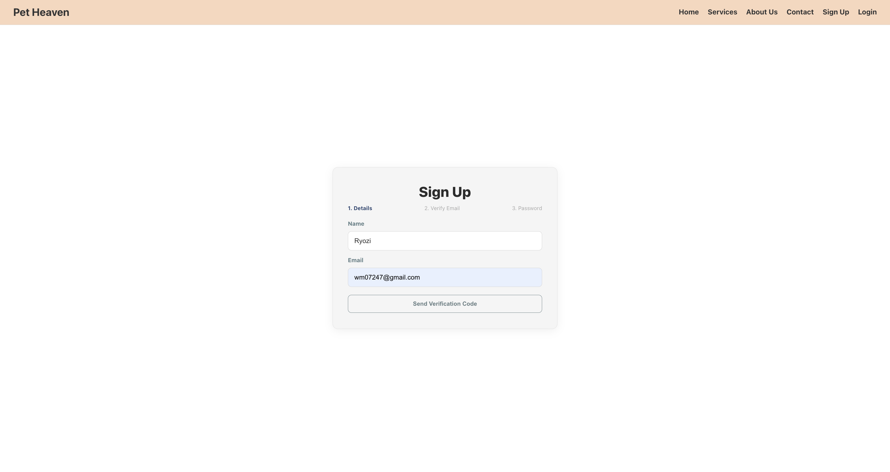

---

## Step 2 — Verification Email

The backend generates a **6-digit verification code** and sends it to the user's email address using **Resend**.

The verification code automatically expires after **10 minutes**.

Below is an example of the verification email received during registration:

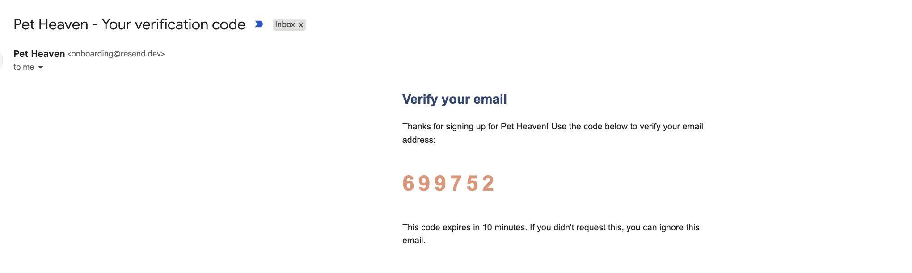

---

## Step 3 — Verify Email Address

The user enters the **6-digit verification code** received by email.

The application validates the submitted code before allowing the user to continue to password creation.

Users can also request a new verification code using the **Resend Code** option.

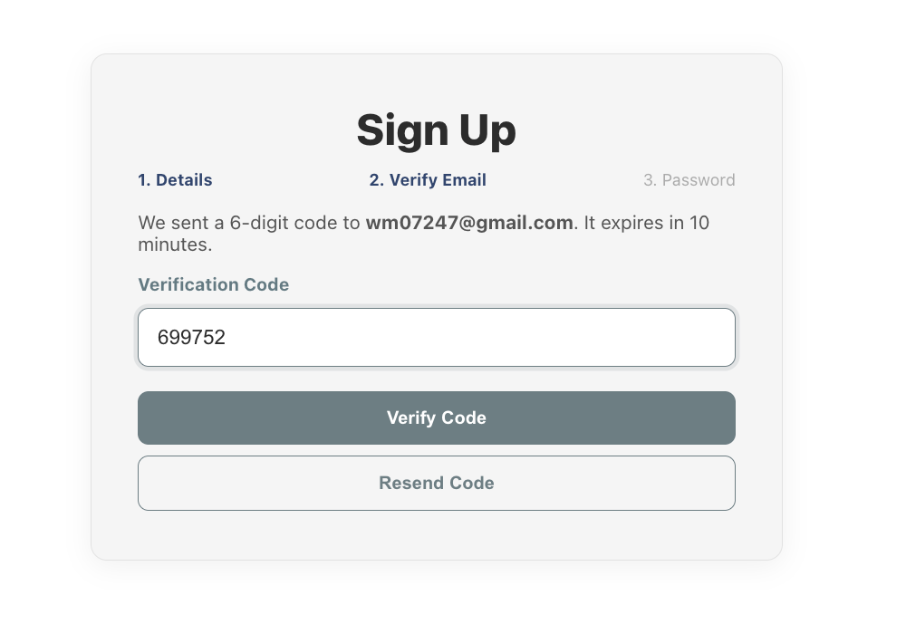

---

## Step 4 — Secure Password Setup

Once the email address has been successfully verified, the user can create a password.

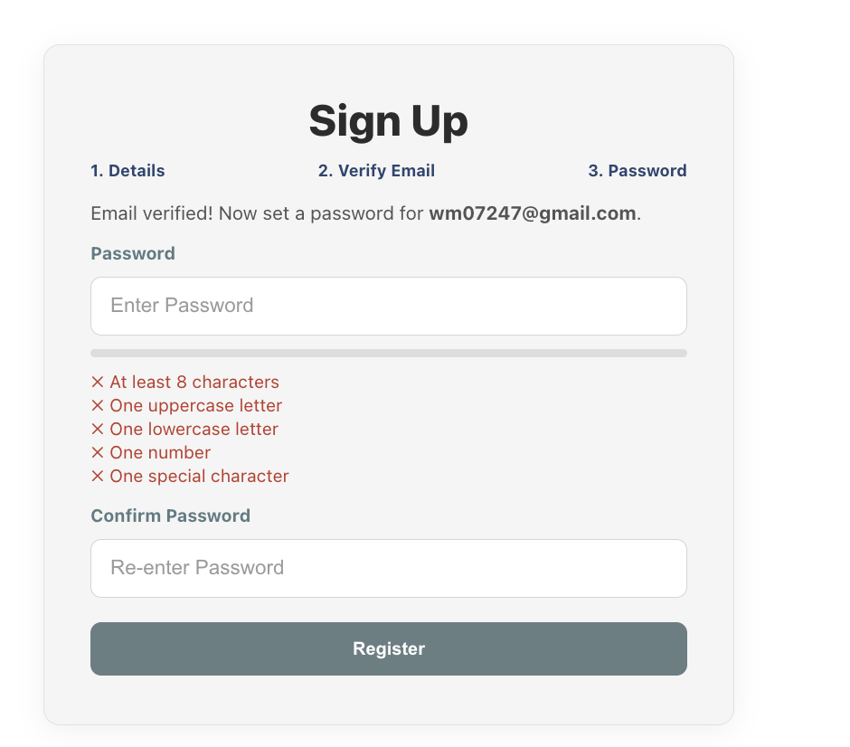

The application performs **real-time password validation**.

A valid password must contain:

- At least **8 characters**
- At least **one uppercase letter**
- At least **one lowercase letter**
- At least **one number**
- At least **one special character**

Each requirement is dynamically updated as the user types.

When a requirement is satisfied, the interface provides immediate visual feedback.

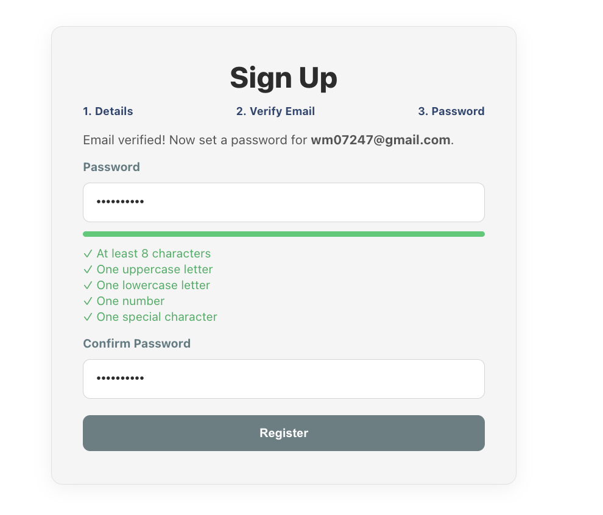

After all requirements are satisfied and the confirmation password matches, the user can complete registration.

Before the password is stored in MongoDB, it is **one-way hashed using `bcryptjs`**, ensuring that the original plaintext password is never stored.

---

# 🔄 Authentication Flow

```text
User enters registration details
            ↓
6-digit verification code generated
            ↓
Verification email sent using Resend
            ↓
User receives verification email
            ↓
User enters verification code
            ↓
Verification code validated
            ↓
Email successfully verified
            ↓
User creates secure password
            ↓
Password requirements validated
            ↓
Password hashed with bcryptjs
            ↓
User account stored in MongoDB Atlas
            ↓
Registration completed
            ↓
User can log in
            ↓
JWT issued for authenticated session
```

This authentication workflow demonstrates the integration of **frontend validation, backend authentication logic, email-based verification, secure password handling, and cloud database persistence** within a full-stack web application.

---

# 👤 User Account Data

After completing email verification and secure password setup, the registered user account is stored in the `users` collection in MongoDB Atlas.

## Hashed Password Storage

The user's password is **not stored as plaintext**.

Before being persisted to MongoDB, it is hashed using `bcryptjs`.

The following screenshot demonstrates how the registered user and hashed password are stored in the `users` collection:

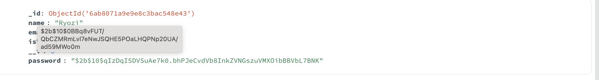

This demonstrates that the original user password is not directly stored in the database.

---

# 🔑 User Login

Registered users can log in using their verified account credentials.

The login process works as follows:

1. The user submits their email and password.
2. The backend retrieves the corresponding user from MongoDB.
3. `bcryptjs` compares the entered password with the stored password hash.
4. After successful authentication, the backend generates a **JSON Web Token (JWT)**.
5. The authentication state is reflected in the frontend interface.
6. Logged-in users can access their profile and logout functionality.

The navigation interface is dynamically updated according to the user's authentication state.

### Successful Login

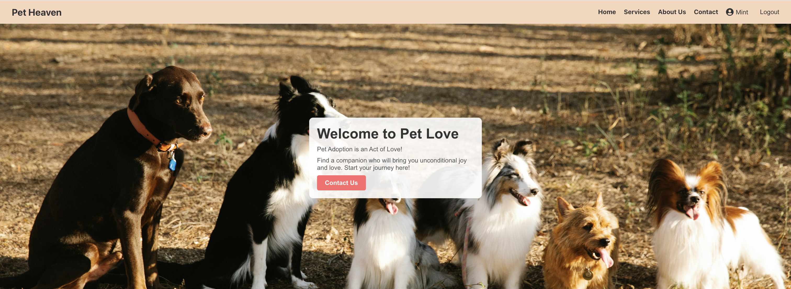

---

# 📊 Demonstrating Data Persistence

Pet Heaven demonstrates the complete flow of operational data from the frontend to persistent database storage.

```text
User Input
    ↓
React Frontend
    ↓
REST API Request
    ↓
Node.js / Express Backend
    ↓
Mongoose
    ↓
MongoDB Atlas
```

The screenshots below demonstrate how information submitted through the application is structured and stored in its corresponding MongoDB collection.

---

## MongoDB Overview

MongoDB provides the persistent database used by Pet Heaven.

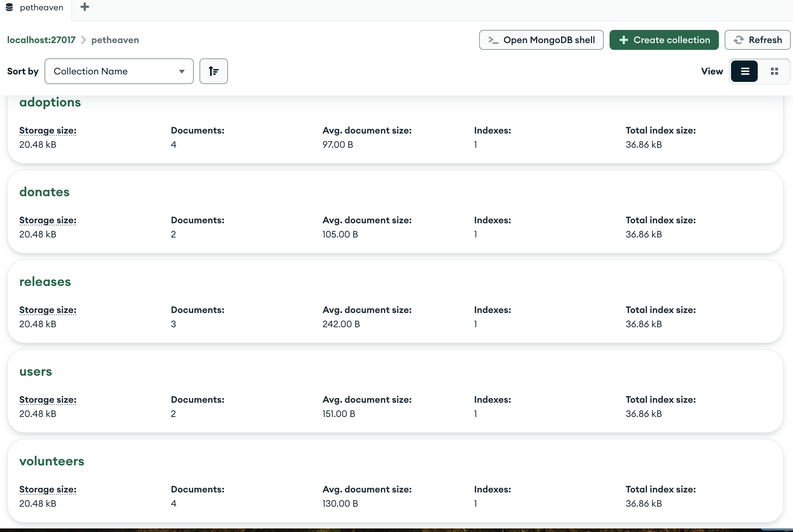

---

## Adoption Form Data

Here's an example of the Adoption Form filled out on the web application:

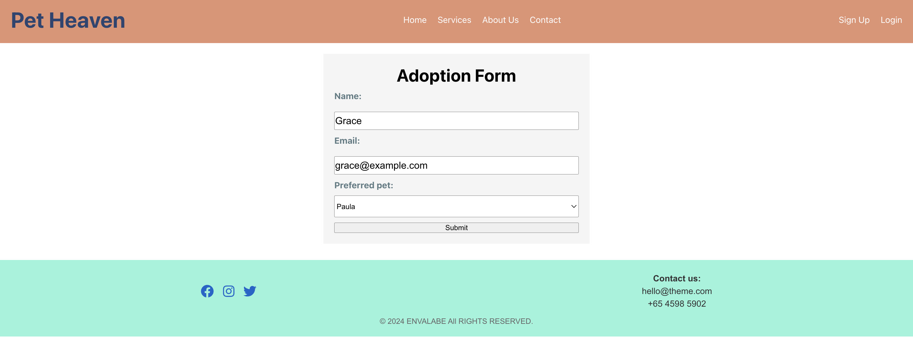

The submitted data is stored in the `adoptions` collection:

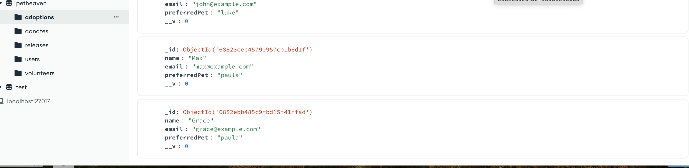

---

## Volunteer Form Data

Here's an example of the Volunteer Form filled out on the web application:

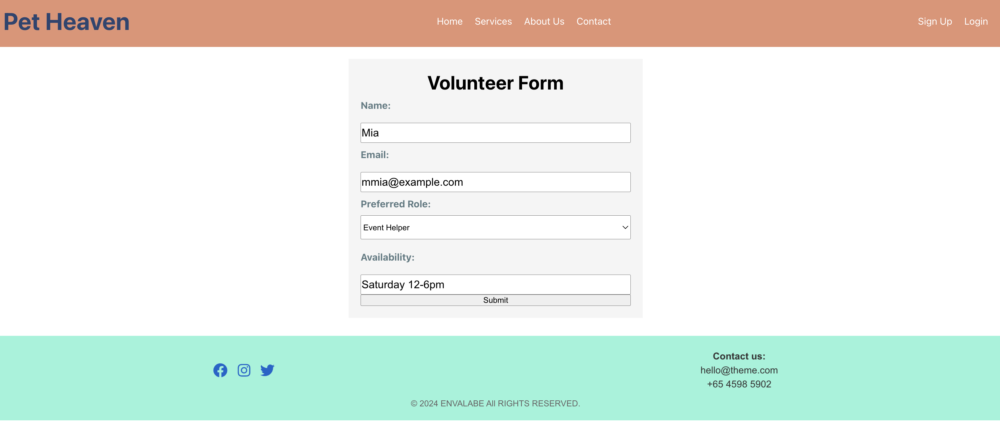

The submitted data is stored in the `volunteers` collection:

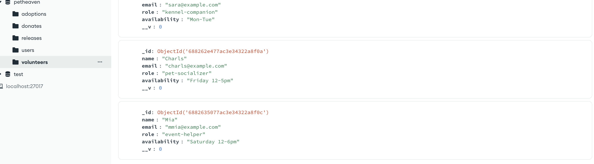

---

## Donation Form Data

Here's an example of the Donation Form filled out on the web application:

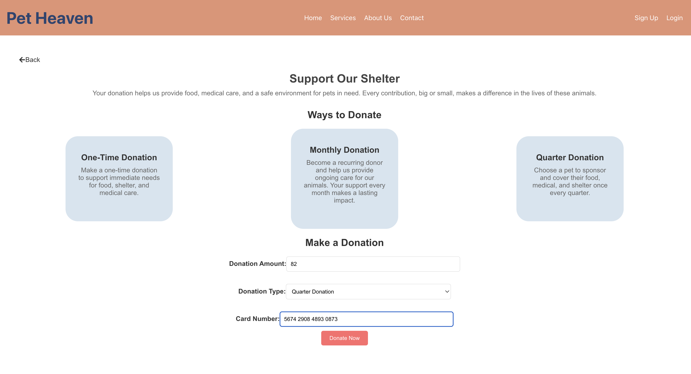

The submitted data is stored in the `donates` collection:

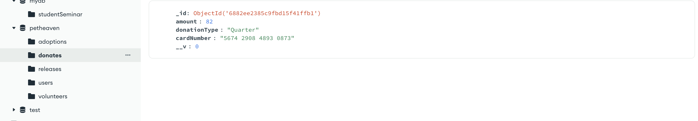

---

## Pet Release Form Data

Here's an example of the Pet Release Form filled out on the web application:

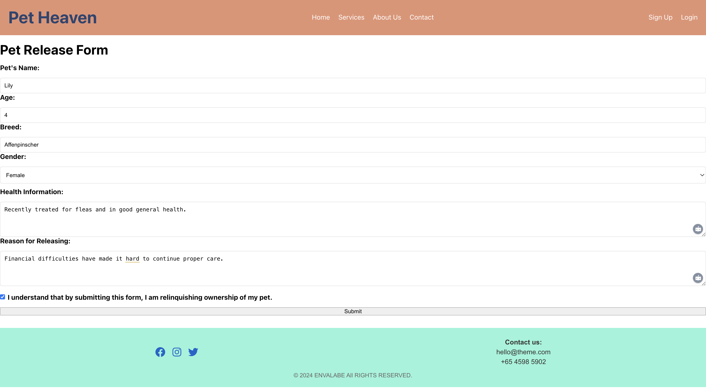

The submitted data is stored in the `releases` collection:

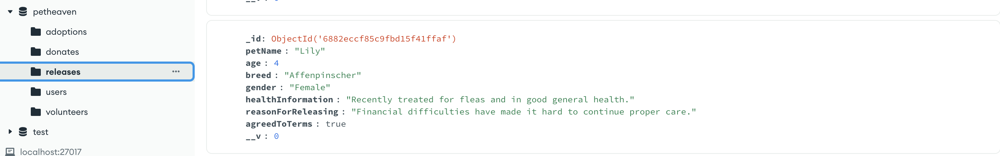

---

# ☁️ Cloud Deployment

Pet Heaven is deployed as a full-stack cloud application.

The production architecture is:

```text
                        User
                          │
                          ▼
                  React Frontend
                Render Static Site
                          │
                          │ HTTPS / REST API
                          ▼
                 Node.js + Express
                Render Web Service
                     │         │
                     │         │
                     ▼         ▼
              MongoDB Atlas   Resend
              Cloud Database  Email Verification
```

## Frontend

The React frontend is deployed using a **Render Static Site**.

**Live Application:**

https://pet-heaven-s0d7.onrender.com

The frontend communicates with the deployed backend using the `REACT_APP_API_URL` environment variable.

---

## Backend

The Node.js + Express backend is deployed as a **Render Web Service**.

The backend handles:

- API requests
- User registration
- Email verification
- Login authentication
- JWT generation
- Password hashing
- MongoDB operations

---

## MongoDB Atlas

The production backend connects to **MongoDB Atlas** rather than relying on a local MongoDB instance.

This allows application data to remain persistent and accessible to the deployed backend.

---

## Resend Email Service

The backend integrates with **Resend** to send verification emails.

During signup:

```text
React Frontend
      ↓
POST /signup/send-code
      ↓
Express Backend
      ↓
Generate 6-digit code
      ↓
Resend API
      ↓
Verification Email
      ↓
User
```

This provides a real email-based verification workflow rather than a development-only verification system.

---

# 📈 Significance from a Data Perspective

This project goes beyond simple web development; it showcases a **practical approach to structuring and collecting diverse types of data generated from real-world service operations**.

The collected data serves as a foundation for future data analysis and machine learning applications.

Potential applications include:

### Predictive Modeling

- Forecasting adoption success rates
- Identifying adoption patterns
- Predicting volunteer retention

### Operational Optimization

- Optimizing volunteer scheduling
- Analyzing shelter intake patterns
- Understanding adoption demand

### Donation Analysis

- Identifying donation patterns
- Evaluating fundraising activity
- Analyzing donation frequency and amounts

### Animal Welfare Insights

- Identifying common reasons for animal relinquishment
- Analyzing animal health information
- Examining breed and intake patterns

### Data Pipeline Foundation

The form-based data collection implemented in Pet Heaven represents the **data ingestion stage** of a broader analytics pipeline.

```text
Data Collection
      ↓
Data Storage
      ↓
Data Processing
      ↓
Data Analysis
      ↓
Machine Learning / Insights
```

---

# 🛠️ Technologies Used

## Frontend

- `React.js`
- `React Router DOM`
- `JavaScript`
- `HTML`
- `CSS`

## Backend

- `Node.js`
- `Express.js`
- `Mongoose`
- `cors`

## Database

- `MongoDB`
- `MongoDB Atlas`
- `MongoDB Compass`

## Authentication & Security

- `bcryptjs`
- `jsonwebtoken (JWT)`
- Email Verification
- 6-Digit Verification Codes
- Password Validation

## Email Service

- `Resend`

## Cloud & Deployment

- `Render Static Site` – Frontend deployment
- `Render Web Service` – Backend deployment
- `MongoDB Atlas` – Cloud database

## Development Tools

- `npm`
- `VS Code`
- `Git`
- `GitHub`

---

# 📁 Project Structure

```text
React-Data-Management/
│
├── client/
│   ├── public/
│   └── src/
│       ├── components/
│       ├── config.js
│       └── ...
│
├── server/
│   ├── models/
│   ├── routes/
│   ├── utils/
│   ├── app.js
│   └── ...
│
├── images/
│   ├── signup_form_input.png
│   ├── email_verification_email.png
│   ├── email_verification_code.png
│   ├── password_setup.png
│   ├── password_validation.png
│   ├── user_data_hashed_password_compass.png
│   └── ...
│
└── README.md
```

---

# 🚀 Setup & Run Locally

To run this project on your local machine, follow these steps.

## Prerequisites

- **Node.js** – v18 or higher recommended
- **npm** or **yarn**
- **MongoDB** or access to **MongoDB Atlas**
- **MongoDB Compass** – Optional, but useful for data verification
- **Resend API Key** – Required for email verification

---

# 📥 Installation

## 1. Clone the Repository

```bash
git clone https://github.com/donghyun18/React-Data-Management.git
cd React-Data-Management
```

---

## 2. Install Backend Dependencies

```bash
cd server
npm install
```

---

## 3. Install Frontend Dependencies

```bash
cd ../client
npm install
```

---

# ⚙️ Environment Variables Setup

Create `.env` files for the required environment variables.

Environment files should **never be committed to GitHub** because they may contain API keys, database credentials, and authentication secrets.

## `server/.env`

```env
PORT=5001
MONGO_URI=your_mongodb_connection_string
JWT_SECRET=your_secure_jwt_secret
RESEND_API_KEY=your_resend_api_key
CLIENT_URL=http://localhost:3000
```

## `client/.env`

```env
REACT_APP_API_URL=http://localhost:5001
```

> ⚠️ Never commit your real `JWT_SECRET`, `RESEND_API_KEY`, MongoDB credentials, or other sensitive environment variables to GitHub.

---

# ▶️ Run the Application

## 1. Start the Backend Server

Open the first terminal window and navigate to the `server` directory:

```bash
cd server
node app.js
```

Or, if `nodemon` is installed:

```bash
nodemon app.js
```

You should see messages indicating that the server is running and successfully connected to MongoDB.

---

## 2. Start the Frontend Client

Open another terminal window:

```bash
cd client
npm start
```

The React application should then be available at:

```text
http://localhost:3000
```

---

# 🔍 Access & Verify Data

## 1. Access the Application

Open the application locally:

```text
http://localhost:3000
```

Alternatively, access the deployed application:

```text
https://pet-heaven-s0d7.onrender.com
```

---

## 2. Test User Registration

Navigate to **Sign Up** and:

1. Enter a name and email address.
2. Request a verification code.
3. Check the verification email.
4. Enter the 6-digit verification code.
5. Create a password that satisfies all requirements.
6. Complete registration.

---

## 3. Test Login

After registration:

1. Navigate to **Login**.
2. Enter the registered credentials.
3. Log in.
4. Verify that the navigation changes according to the authenticated state.
5. Access the user profile.
6. Test logout.

---

## 4. Interact with the Data Collection Forms

Navigate to the:

- Adoption Form
- Volunteer Form
- Donation Form
- Pet Release Form

Fill out and submit the forms.

---

## 5. Verify Data Storage

Open **MongoDB Compass** or access the MongoDB Atlas database.

Inspect the relevant collections:

```text
adoptions
volunteers
donates
releases
users
```

Submitted information should appear in its corresponding collection.

For registered users, the stored password should appear as a **bcrypt hash instead of the original plaintext password**.

---

# 🔮 Future Enhancements

Pet Heaven is now deployed as a functional full-stack cloud application. Future improvements could include:

- **Role-Based Access Control:** Add separate permissions for regular users, shelter staff, and administrators

- **Protected Routes:** Restrict administrative and account-specific pages according to authentication status and user roles

- **Password Recovery:** Implement a secure forgot-password and password-reset workflow using email verification

- **Admin Dashboard:** Allow shelter administrators to manage adoption applications, volunteers, donations, users, and pet release records

- **Application Status Tracking:** Allow users to monitor the progress of adoption applications

- **Data Visualization & Analytics Dashboard:** Visualize adoption rates, volunteer activity, animal intake, and donation trends using libraries such as `Chart.js`

- **Advanced Data Analysis:** Apply machine learning techniques to collected shelter data for adoption prediction, volunteer demand forecasting, and donation analysis

- **Automated Notifications:** Expand the email system to send adoption and volunteer application updates

- **Automated Testing:** Add frontend and backend unit and integration tests

- **CI/CD:** Introduce automated testing and deployment workflows

- **Responsive Design:** Further optimize the application for mobile and tablet devices

---

# 📌 Project Summary

Pet Heaven demonstrates the integration of:

```text
React Frontend
      ↓
Node.js / Express Backend
      ↓
Email Verification with Resend
      ↓
Secure Authentication
      ↓
bcrypt Password Hashing
      ↓
JWT Session Management
      ↓
MongoDB Atlas Data Persistence
      ↓
Render Cloud Deployment
```

The project combines **full-stack software development, authentication security, cloud deployment, and structured data collection**, while providing a foundation for future data analytics and machine learning applications.

---

# 👨‍💻 Author

**Donghyun Lee**

MSc Artificial Intelligence  
University of Leeds

GitHub: [donghyun18](https://github.com/donghyun18)
